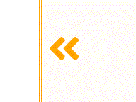

# 애니메이션 트릭

## 1. 애니메이션 재실행

버튼 클릭 시 하나의 키프레임을 사용해서 애니메이션을 구현하고 싶었다.

 < 예시 (opacity)

클래스명에 애니메이션을 적용 후,  
해당 클래스명을 제거-추가 하는 등 여러가지 방법을 써봤으나 애니메이션이 처음 1회만 실행되고 실패.

구글링해보니 클래스명의 제거-추가 스크립트 사이에 `void element.offsetWidth;` 를 넣어주는 간단한 방법을 찾았다.

강제로 요소의 크기를 요청해 브라우저에게 변화를 클래스명을 제거하고 추가하는 사이에 변화를 감지시키는 모양이다.

```js
const animationRestart = (e) => {
  e.target.classList.add("className");
  // Trick
  void e.target.offsetWidth;
  e.target.classList.remove("className");
};
```

<br />

## **참고**

---

[1. 애니메이션 재실행](https://css-tricks.com/restart-css-animation/)
